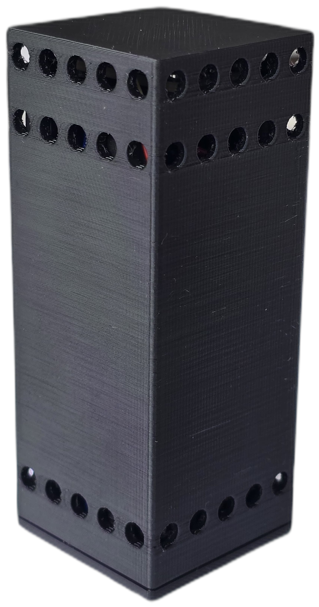
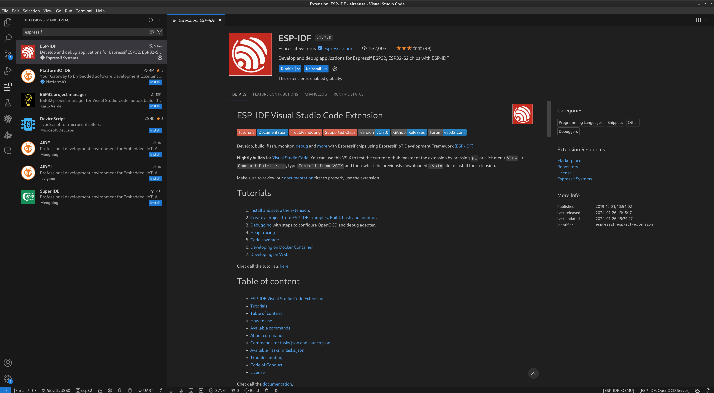
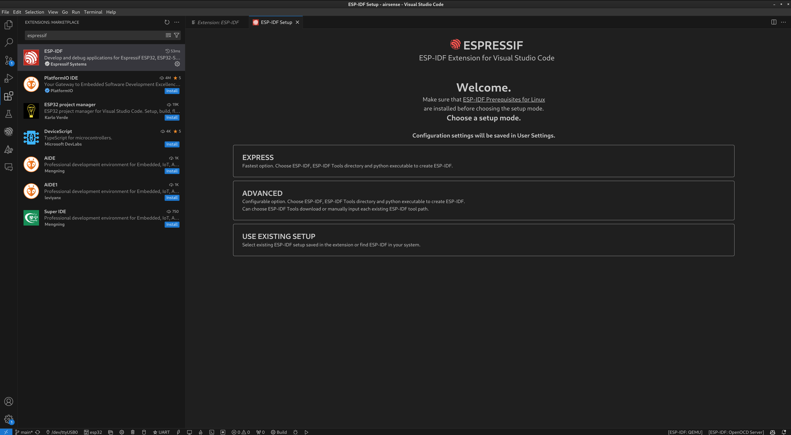
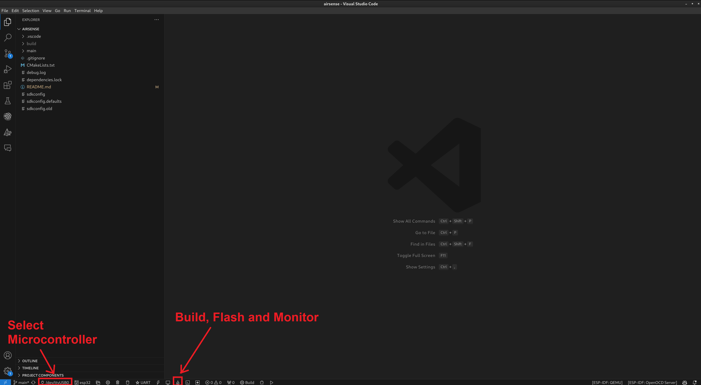

# AirBee

AirBee is an air quality sensor that records data on temperature, humidity, air pressure and organic gases. These measured values are transmitted using ZigBee technology.

AirBee was developed as part of my master's thesis on ‘Analysis and optimisation of radio transmission technologies and software to extend the battery life of IoT devices’ as part of a prototype implementation.

## Hardware

The following components are required to build AirBee:
- [FireBeetle 2 ESP32-C6 from DFRobot](https://www.dfrobot.com/product-2771.html)
- [BME680 - Temperature, Humidity, Pressure and Gas Sensor from Adafruit](https://www.adafruit.com/product/3660)
- [ICR18650 Li-Ion battery](https://eckstein-shop.de/Li-Ion-Akku-Lithium-Ionen-Batterie-ICR18650-37V-2200mAh-ohne-Schutzschaltungsmodul-und-Stecker)

You can find the circuit diagram [here](./assets/circuit_diagram/airbee_circuit_diagram.pdf).

You can find the files for 3D printing the housing [here](./assets/case/).

## Setup

I recommend VsCode for building and flashing the firmware. You can download Visual Studio Code [here](https://code.visualstudio.com/).

As i use the [ESP-IDF Framework](https://docs.espressif.com/projects/esp-idf/en/latest/esp32/get-started/) for development, we also need the ESP-IDF Extension.

You can find these in the VsCode Extension Store if you search for "espressif". Then click on Install here.

After the installation, a window will open where you can install the framework. It is best to select "Express" here.

## Build, Flash and Monitor

Connect the microcontroller to your PC via USB.

You can select the microcontroller at the bottom left of the bar.

Now all you have to do is click on the flame. The software will then be built automatically, flashed to the microcontroller and the serial terminal opens.

## Configuration

Measurement intervals, the name of the sensor and the transmission intervals can be configured in [config.h](./main/config.h).